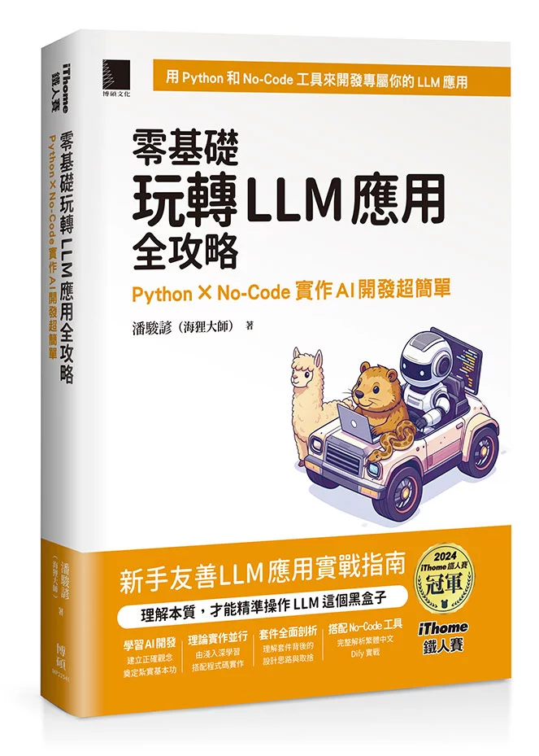

# 零基礎玩轉 LLM 應用全攻略：Python × No-Code 實作 AI 開發超簡單



Hi 🦫！想必你是看了這本書才會點進這個連結吧，這裡是《零基礎玩轉 LLM 應用全攻略》的 GitHub Repo，所有書籍內會用到的程式碼都放在這邊～

至於書籍勘誤相關資訊會放在[書籍官網](https://llm-book.yenslife.top/)，若你在看這本書遇到哪邊怪怪的，非常歡迎用官網的 E-mail 聯絡我，第一次寫書嘛我也怕出ㄘㄟˊ🥹，但請記得說說你是誰，為什麼要寄這封信，以免我把你當成詐騙訊息喔（現在詐騙太多了，唉）

## 我的使用方法

除了少數沒有程式碼的章節外，幾乎所有章節都有對應的範例程式碼。可以看到上面的資料夾名稱，就是對應的章節編號 (除了 `basic-llm-demo` 和 `transformer-demo`)，點進去後就可以找到在書中使用 `chapter[章節名稱]/檔案名稱` 標注的完整範例程式碼。

或者你也可以直接複製這個 Repo 到你的電腦中使用與執行

```bash
git clone https://github.com/yenslife/python-llm-for-beginners-demo-code.git
```

需要注意的是，每一個章節都有自己的獨立執行環境，需要到個章節內使用 uv 來執行。比方說我現在在看〈3.5 正式說你好〉這一個章節，在 3.5.1 小節內有一份範例程式碼是 `basic-llm-demo/chat-completion-basic.py`。這個時候，你可以用 `cd` (change directory) 命令來進入這個目錄

```bash
$ cd basic-llm-demo
```

若你不確定有沒有成功可以用 `pwd` (print working directory) 來確認自己所在的位置

```bash
$ pwd
/Users/mac/鐵人賽出書/demo-code/basic-llm-demo
```

然後就可以用 `uv` 來執行 `chat-completion-basic.py` 了！記得要自己建立一份 `.env` 檔案，放入你的 API Key，這部分書中有更清楚的說明請一定要仔細看喔！執行以下指令後資料夾內會產生一個 `.venv` 資料夾，就是該章節的虛擬環境喔！

```bash
$ uv run chat-completion-basic.py
LLM 的回應: 哈囉海狸大師你好呀！🤗
我是你的專屬AI小助理──ChatGPT 🤖✨，隨時待命為你服務。
有什麼奇思妙想或疑難雜症想和我分享嗎？😄🦫
LLM 的用量: CompletionUsage(completion_tokens=273, prompt_tokens=61, total_tokens=334, completion_tokens_details=CompletionTokensDetails(accepted_prediction_tokens=0, audio_tokens=0, reasoning_tokens=192, rejected_prediction_tokens=0), prompt_tokens_details=PromptTokensDetails(audio_tokens=0, cached_tokens=0)
```

## 引用我的書

如果你覺得我的書或者程式碼對你的研究有所幫助，歡迎引用它

```
Pan, C.-Y. (2026). 零基礎玩轉 LLM 應用全攻略：Python × No-Code 實作 AI 開發超簡單. 博碩文化.
GitHub repository: https://github.com/yenslife/python-llm-for-beginners-demo-code
```

BibTeX 格式：
```bibtex
@book{Pan2026LLMFromScratch,
  title     = {零基礎玩轉 {LLM} 應用全攻略：{Python} × {No-Code} 實作 {AI} 開發超簡單},
  author    = {Pan, Chun{-}Yen},
  year      = {2026},
  publisher = {DrMaster},
  isbn      = {9786264144056},
  note      = {Example code available at \url{https://github.com/yenslife/python-llm-for-beginners-demo-code}}
}
```

## 購買連結

歡迎用你喜歡的管道購買本書，後續有更多管道也會持續更新！～
- [博客來](https://www.books.com.tw/products/0011046117?loc=M_0004_001)
- [天瓏書局](https://www.tenlong.com.tw/products/9786264144056?list_name=p-r-zh_tw)

